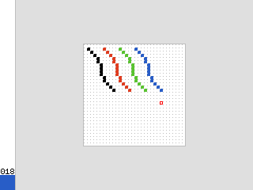

# Pixel-84PCE

Pixel art editor for the TI-84 Plus CE!

## Controls

|Button|Action|
|-|-|
|Arrows|Move|
|2nd|Draw|
|Alpha|Pick|
|Del|Delete|
|+|Next Color|
|-|Previous Color|
|*|Zoom In|
|/|Zoom Out|
|8|Pan Up|
|2|Pan Down|
|4|Pan Left|
|6|Pan Right|
|5|Reset Pan|
|Mode|Quit|

## Screenshots

